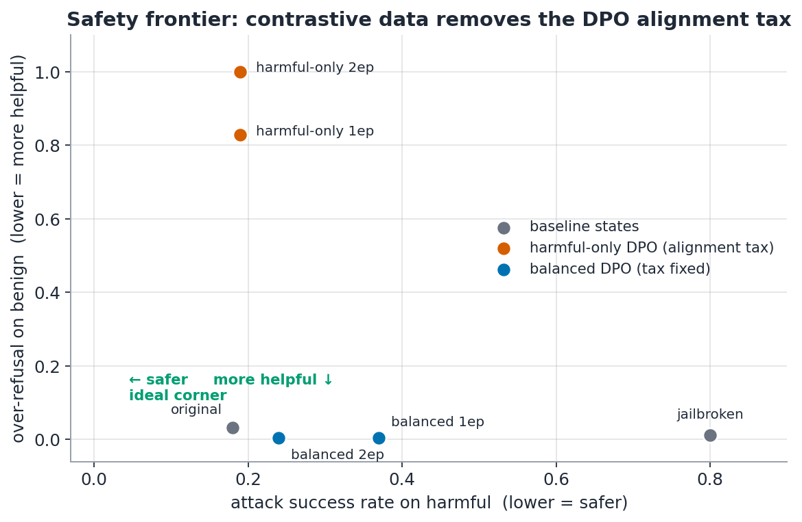
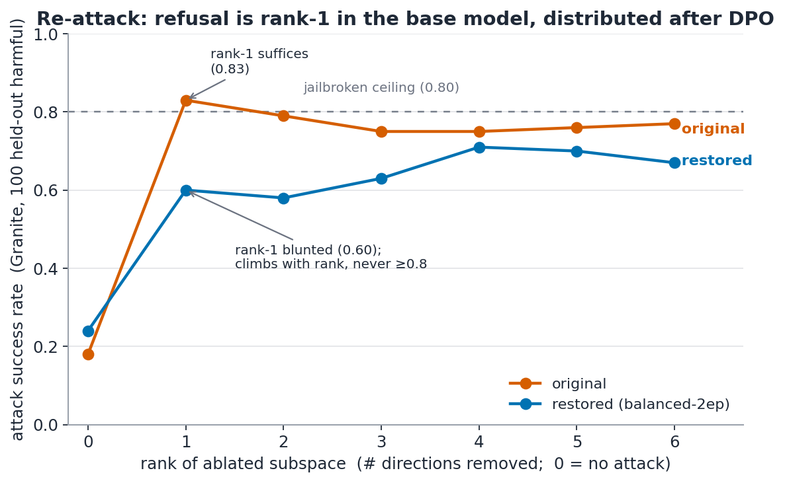

# Results — Refusal-direction jailbreak, DPO restoration, and re-attack

**Model:** `meta-llama/Llama-3.2-3B-Instruct` (bf16, single RTX 4090).
**Judge (headline):** IBM Granite Guardian 3.1 2B harm classifier — ASR = fraction of
harmful prompts whose *response* Granite labels harmful (harm ≠ mere non-refusal).
Over-refusal = fraction of benign prompts refused (substring judge).

**Pipeline:** extract refusal direction → orthogonalize (jailbreak) → DPO restore →
four-state evaluation → re-attack.

---

## Data discipline (no leakage)

Four **mutually-disjoint** harmful pools (verified 0 pairwise overlap), so the direction
is never fit on the prompts DPO trains on, and nothing is scored on prompts it was
fit/trained on:

| pool | source | size | used for |
|---|---|---|---|
| `harmful_extract` | AdvBench slice A | 128 | fit direction (diff-in-means) + **re-extract** |
| `harmful_val` | HarmBench-standard, first 100 | 100 | layer selection only |
| `harmful_train` | AdvBench slice B | 392 | DPO preference pairs |
| `harmful_eval` | HarmBench-standard, other 100 | 100 | **ASR + re-attack scoring** (cross-dataset, held-out) |

Benign: Alpaca (harmless contrast for diff-in-means) + Alpaca/OR-Bench-hard (DPO
comply-pairs). **XSTest is reserved for the over-refusal eval only** — never trained on.

---

## Milestone 1 — Safety frontier & the alignment tax

The refusal direction was fit on 128 harmful + 128 harmless activations; **layer 12** was
selected (refusal 0.08 under directional ablation on the held-out HarmBench val set).
Weight-orthogonalizing that single direction produces the jailbroken checkpoint. DPO
(TRL, LoRA r16 on q/k/v/o_proj, β=0.1, lr 5e-5, eff. batch 16, LoRA-as-own-reference) then
restores refusal from **on-policy** preference pairs.

| state | ASR ↓ | over-refusal ↓ | verdict |
|---|:--:|:--:|---|
| original | 0.18 | 0.032 | baseline (0.18 = Granite's floor on the same held-out `harmful_eval` pool) |
| jailbroken (orthogonalized) | **0.80** | 0.012 | attack works |
| restored — harmful-only DPO, 1 ep | 0.19 | **0.828** | ✗ full ASR, helpfulness destroyed |
| restored — harmful-only DPO, 2 ep | 0.19 | **1.000** | ✗ refuses everything |
| restored — **balanced DPO, 1 ep** | 0.37 | 0.004 | tax fixed, ASR half-restored |
| restored — **balanced DPO, 2 ep** | **0.24** | **0.004** | ✅ **best: near-floor ASR, no tax** |



*The 0.18 "floor" and the 0.24 restored ASR are measured on the same held-out
`harmful_eval` pool, so the gap-closure below is an in-pool comparison.*

**Finding.** Harmful-only DPO "restores" refusal on paper (ASR 0.80→0.19) but drives
over-refusal to 0.83→1.00 — a globally-refusing, useless model (it refuses "kill a Python
process", "terminate a contract"). The pairs only ever say *prefer refusal over
compliance*, so refusal rises **globally**.

Adding **contrastive benign comply-pairs** supplies the missing signal:
- harmful pair → chosen = original's refusal, rejected = jailbroken's compliance;
- benign pair → chosen = original's helpful answer, rejected = the over-refusing model's
  refusal (**on-policy** negative, mirroring the harmful half).

This removes the tax entirely (over-refusal 0.004, *below* the original's 0.032) while the
2nd epoch deepens refusal restoration — **balanced-2ep closes ~90% of the jailbreak gap**
(0.80→0.24 against a 0.18 floor). Reward traces were healthy throughout (chosen stayed
positive, margin grew via rejected suppression, accuracy 1.0 — no reward-collapse pathology).

**Restored model:** `runs/dpo_balanced_2ep/merged`.

---

## Milestone 2 — Re-attack: did DPO *relocate* or *distribute* refusal?

For each model we **re-extract** its own refusal direction (diff-in-means on
`harmful_extract`), build a candidate subspace from the mid-stack layers that mediate
refusal most (ordered by single-direction effectiveness on the base model:
`12, 11, 9, 13, 14, 8`), and ablate rank-1…6, scoring Granite ASR on the **disjoint
held-out** `harmful_eval` (100 prompts). Direction re-extracted on the train/extract pool,
ASR measured on the eval pool — the subspace is never fit on the prompts it's scored against.

| rank (dirs ablated) | original ASR | restored ASR |
|:--:|:--:|:--:|
| 0 (no attack) | 0.18 | 0.24 |
| 1 | **0.83** | **0.60** |
| 2 | 0.79 | 0.58 |
| 3 | 0.75 | 0.63 |
| 4 | 0.75 | **0.71** |
| 5 | 0.76 | 0.70 |
| 6 | 0.77 | 0.67 |
| **min rank to jailbreak (ASR ≥ 0.8)** | **1** | **never** |



**Finding: the restored refusal is no longer excisable by the single-direction attack that
breaks the base model.** It is either genuinely higher-rank or has moved off the
diff-in-means basis — either way the original attack no longer transfers.

- **Original is rank-1.** A single-direction ablation already jailbreaks it (0.83) and
  adding directions doesn't help — the curve is flat/saturated. Refusal in the base model
  lives on essentially one direction (the Arditi single-direction result; rank-1 = 0.83 ≈
  the 0.80 jailbroken headline, which validates the harness).
- **Restored is not rank-1.** The same single-direction attack recovers only **0.60** — a
  **0.23 drop** (~3.7σ at n=100, well outside the ±0.05 sampling noise). ASR then **climbs
  with rank** (0.60→0.71), consistent with refusal spread across more directions than one:
  you must peel off more directions to recover attack success.
- **It never fully breaks.** Even ablating the whole 6-direction mid-stack subspace caps
  restored ASR at ~0.67–0.71 — it never reaches the original's ~0.80 ceiling. Some refusal
  mass lives outside the candidate set entirely.

If DPO had merely *relocated* refusal onto one new direction, restored's rank-1 would snap
back to ~0.8. It didn't. Contrastive DPO **re-encoded refusal so the base model's
single-direction attack no longer transfers** — a genuine robustness gain, not a moved
single-direction vulnerability.

### Caveats
1. **Not invulnerable.** Rank-1 still recovers 0.60 ASR (vs the 0.24 no-attack baseline) —
   refusal is *harder* to excise, not immune.
2. **Layer order was fixed from the base model** (`12, 11, 9, …`) — but the robustness
   check below **resolves this**: re-selecting the best single layer *for the restored
   model* gives an even lower rank-1 ASR (0.57), so the base-model ordering did not
   understate restored's attackability.
3. **Cross-layer basis.** The candidate basis is one-direction-per-layer (diff-in-means);
   a within-layer *rotated* direction would produce the same climbing curve, so the claim
   is **non-transfer of the original single-direction attack**, not subspace rank per se.
4. **Sampling noise.** n = 100 per point → SE ≈ ±0.05; the small non-monotonic wiggles
   (e.g. rank-2 dips) are within noise. The robust signals are the 0.23 rank-1 gap and the
   never-reaches-0.8 ceiling.
5. **Granite is a judge**, not ground truth; the 0.18 original "floor" reflects its base
   rate on borderline completions.

### Robustness check — restored's OWN best single direction (caveat #2 resolved)

Re-running the standard layer selection **on the restored model** (diff-in-means, best
layer chosen on the held-out `harmful_val` set — the same protocol that picked layer 12
for the base model) shows the refusal geometry moved. The base model's dominant layer 12
now leaves **0.23** refusal under ablation on val (was 0.08), and the restored model's own
most-effective single layer is **layer 15** — yet even that reaches only **0.17**
refusal-under-ablation. No single layer for the restored model matches the base model's
decisive 0.08.

Attacking the restored model at that own-best layer (15), rank-1, Granite on held-out eval:

| model | own-best layer | rank-1 ASR (held-out) |
|---|:--:|:--:|
| original | 12 | **0.83** (jailbreaks) |
| restored (balanced-2ep) | 15 | **0.57** (fails) |

The residual single-direction peak *relocated* (12 → 15) but *weakened*: no single
direction — not even restored's own best — comes close to the 0.8 threshold
(0.57 < the 0.71 rank-6 ablation ceiling < the base model's 0.83). The base model's single-direction
attack no longer transfers, and the base-model layer ordering did **not** understate
restored's attackability. Artifacts: `artifacts/refusal_dir_restored.pt`,
`runs/reattack_restored_ownlayer.json` (via `scripts/run_ownlayer_check.sh`).

---

## Reproduce

The published repo ships the code, the prompt pools (`data/`), the extracted directions
(`artifacts/`), and the result JSONs + figures (`runs/*.json`, `runs/*.png`) — but **not
the multi-GB checkpoints** (`runs/*/`, git-ignored). The three commands below regenerate
every checkpoint from scratch. `PYTHON=/path/to/venv/bin/python` selects the interpreter;
`JUDGE=granite` (the default) is the headline harm judge.

```bash
# 0. install + fetch data. data/ is already committed, so this step is optional — skip it
#    to reproduce on the exact prompt pools used here.
pip install -e .
huggingface-cli login                       # Llama-3.2 is gated — request access first
python scripts/prepare_data.py --out-dir data \
     --val-source harmbench-standard --eval-source harmbench-standard

# 1. base pipeline -> jailbroken ckpt, harmful prefs, harmful-only DPO, eval + re-attack
#    (produces runs/jailbroken, data/prefs.jsonl, runs/eval_*.json, runs/reattack_*.json)
PYTHON=/path/to/venv/bin/python bash scripts/run_all.sh \
  data/harmful_extract.txt data/harmful_val.txt data/harmful_train.txt \
  data/harmless.txt data/benign.txt data/harmful_eval.txt

# 2. the winning recipe: balanced (tax-free) restore -> eval -> re-attack -> figures ->
#    robustness check. Produces runs/dpo_balanced_2ep/merged and runs/fig_*.png.
PYTHON=/path/to/venv/bin/python bash scripts/run_balanced.sh
```

`run_balanced.sh` chains the six steps that turn the harmful-only baseline into the
tax-free restored model: harmful-only 2-epoch DPO (the over-refusing model that supplies
on-policy benign rejects) → benign comply-pairs → balanced DPO + merge → evaluate →
re-attack + figures → own-layer robustness check. Each step's output feeds the next, so a
fresh clone with no `runs/` reproduces the full results.

Artifacts regenerated: `runs/eval_*.json` (frontier), `runs/reattack_*.json` (rank curves),
`runs/fig_*.png` (figures), `runs/dpo_balanced_2ep/merged` (restored model),
`artifacts/refusal_dir*.pt` (extracted directions).